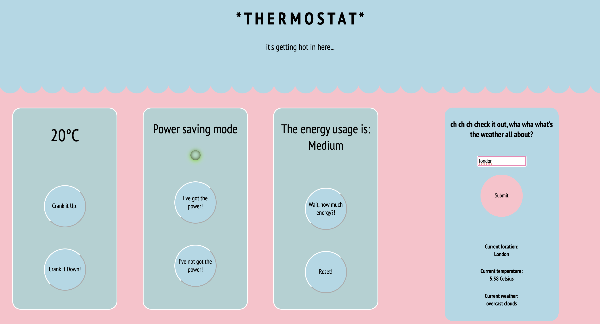

### Specification:

[x] Thermostat starts at 20 degrees  
[x] You can increase the temperature with an up function  
[x] You can decrease the temperature with a down function  
[x] The minimum temperature is 10 degrees  
[x] If power saving mode is on, the maximum temperature is 25 degrees  
[x] If power saving mode is off, the maximum temperature is 32 degrees  
[x] Power saving mode is on by default but it can also be turned off  
[x] You can reset the temperature to 20 with a reset function  
[x] You can ask about the thermostat's current energy usage: < 18 is low-usage, <= 25 is medium-usage, anything else is high-usage.  
[ ] (In the challenges where we add an interface, low-usage will be indicated with green, medium-usage indicated with black, high-usage indicated with red.)  

---

### User interface requirements

[x] current temperature display  
[ ] max temperature display  
[x] energy usage display  

[x] temperature up button  
-> [x] updates current temp display  
[x] temperature down button  
-> [x] updates current temp display  
[x] thermostat reset button  
-> [x] updates max temp and current temp displays  
[x] power mode on button  
-> [ ] updates max temp display   
[x] power mode off button  
-> [ ] updates max temp  
[x] energy usage button  
-> [x] updates energy usage display  

---

### To-Do

[ ] switch from having an energy usage button to a display that auto updates
[ ] saving state

---
